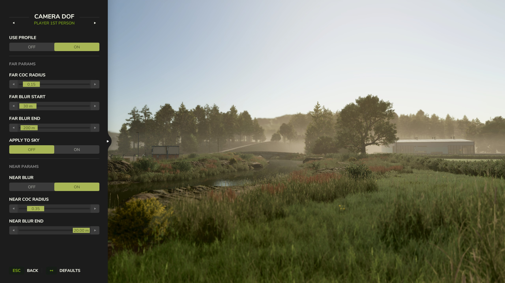
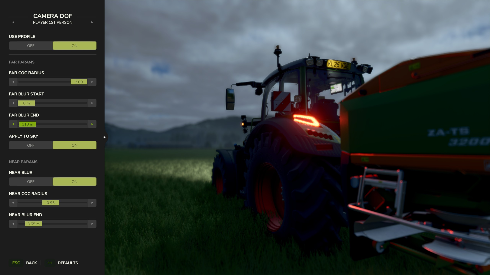
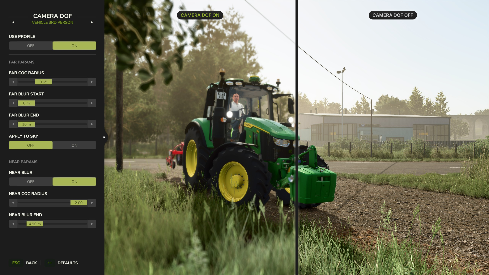
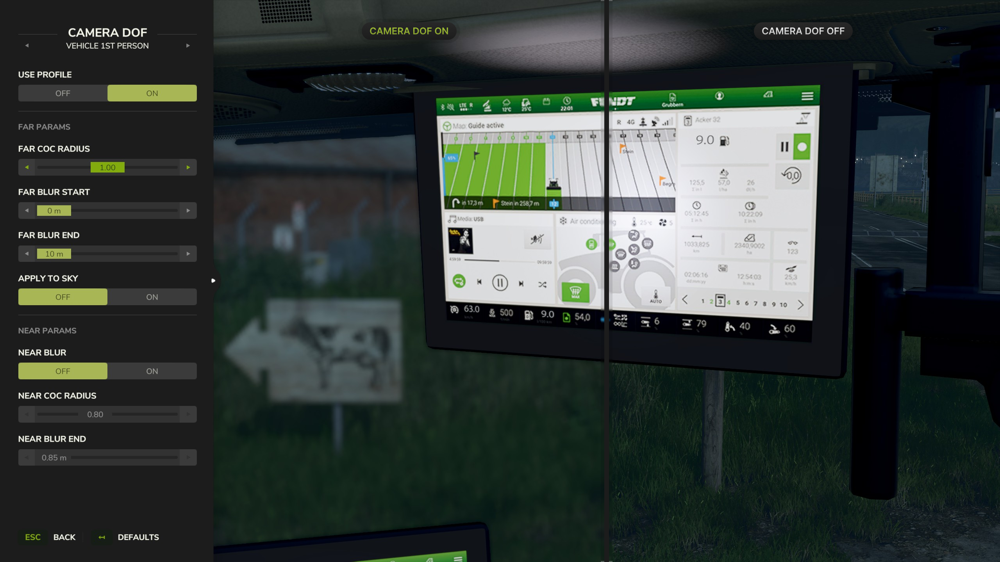

   
  <b>Camera DoF</b> adds cinematic depth to your gameplay &mdash;
   
  take full control over the camera's depth-of-field effect and fine-tune near and far blur independently for every camera perspective in real time.
   
   

## Features

- **Separate Profiles:** Configure 4 separate blur profiles: Vehicle 1st Person, Vehicle 3rd Person, Player 1st Person, and Player 3rd Person.
- **Customizable Parameters:** Adjust near and far blur parameters including CoC radius, blur distances, and sky application.
- **Toggleable Profiles:** Enable or disable each profile individually &mdash; disabled profiles fall back to the game's default DOF.
- **Easy Reset:** Reset any profile to built-in defaults with a single click. Settings are saved automatically.

## Installation

1. Download the latest version of the mod from the [Releases](https://github.com/modnext/cameraDof/releases/) page or the official [ModHub](https://www.farming-simulator.com/mod.php?mod_id=000000000).
2. Copy the downloaded `.zip` file to your Farming Simulator mods folder:
   - Windows: `Documents\My Games\FarmingSimulator2025\mods\`
   - macOS: `~/Library/Application Support/FarmingSimulator2025/mods/`
   - Linux: `~/FarmingSimulator2025/mods/`
3. Start Farming Simulator 2025 and enable the mod in the Mods menu.

## Keybindings

| Key         | Action                                                                   |
| ----------- | ------------------------------------------------------------------------ |
| `F6`        | Open the Camera DoF settings dialog                                      |

## Screenshots

## License

Distributed under the GPL-3.0 license. See [LICENSE](https://github.com/modnext/cameraDof/blob/main/LICENSE) for more information.
